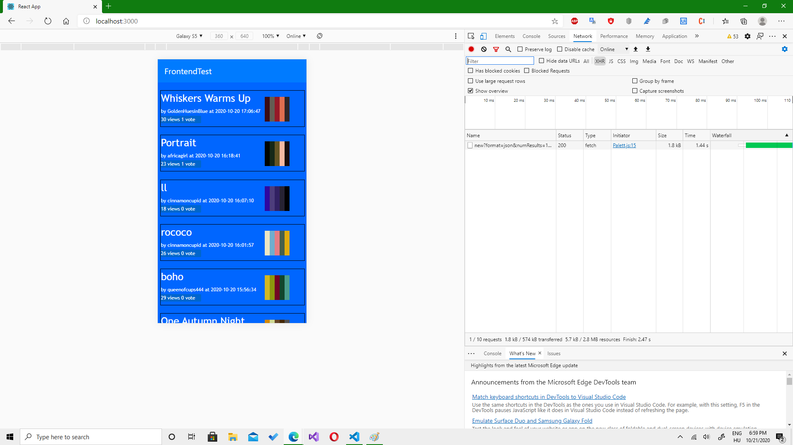

# FrontendTest
- Egy reszponzív internetes alkalmazás, ami színpalettákat mutat (alapesetben tízet, illetve ha a honlap aljára görget a felhasználó még tíz palettát felhoz az alkalmazás) a colourlovers api használatával. 3 nézetben elérhető:
# Mobil:

# Tablet:

# Desktop:

